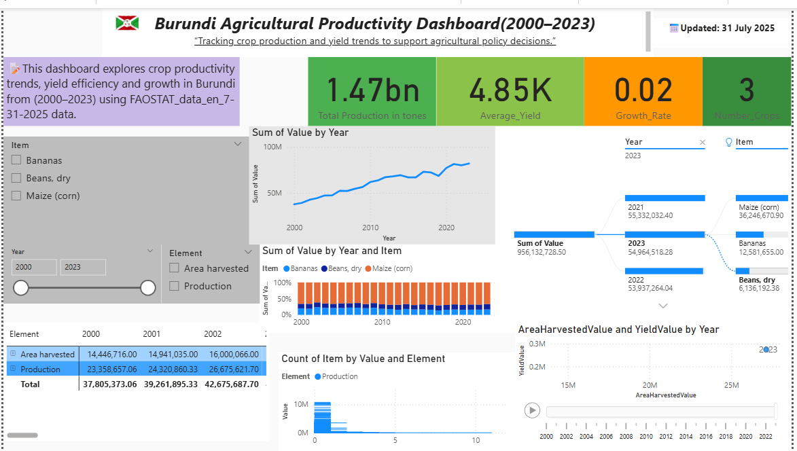

#🌿Burundi Agricultural Productivity Analysis

This capstone project of Burundi’s economy heavily depends on agriculture, which employs over 80% of the population and contributes significantly to GDP(Gross Domestic Product). 
However, the sector faces challenges in productivity, planning, and data accessibility.  
This project aims to visualize and interpret agricultural trends using data from FAOSTAT (2000- 2023).

---

## 📌 Project Goals
- Analyze crop production, yield, and harvested area
- Identify growth patterns and productivity
- Provide actionable insights for policy and decision-making

## 📂 Folder Structure
- `/data`: Raw and cleaned CSV dataset
- `/notebooks`: Python analysis scripts and notebooks
- `/powerbi`: Power BI dashboard file (`.pbix`)
- `/images`: Dashboard screenshots and others
- `/DAX_FORMULAS`: Formulas used in DAX
- `/presentation`: PDF presentation

## 🛠️ Tools Used
- Python (Pandas, Matplotlib, Seaborn)
- Power BI (DAX, slicers, drill-downs)
- Git & GitHub

## 📈 Highlights
- Interactive trend analysis by crop
- Yield and area comparison charts
- Growth rate KPIs
- Decomposition tree and scatter plots
  
## 🧭 Future Work

- Integrate **regional/provincial data** for deeper analysis
- Include **seasonal patterns** to account for crop cycles
- Extend scope to **livestock productivity** and fertilizer use
  
## 📝 How to Run
1. Clone the repo
2. Open and explore the Jupyter Notebook in `/notebooks/`
3. Open the `.pbix` file in Power BI to view the dashboard

## 📸 Screenshots

## 🔗 Contact
**Author**: Faisal SHINGIRO  
**Email**: faisalshingiro10@gmail.com
